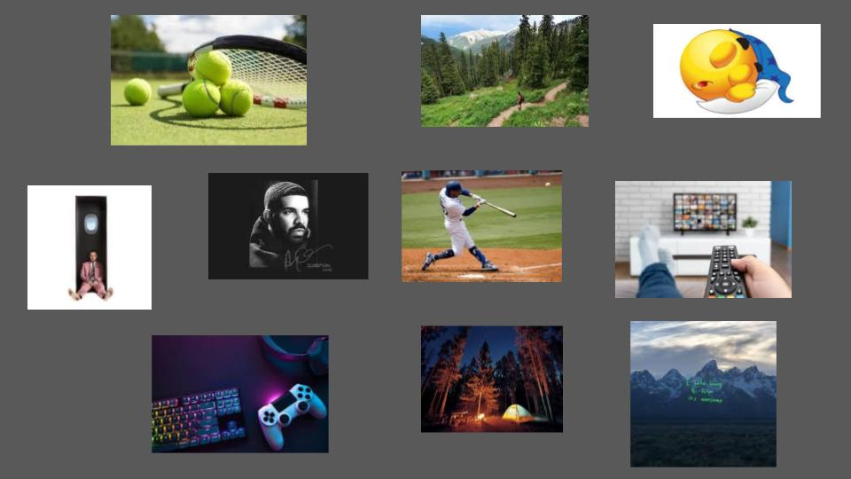

# me-in-markdown
## Introduction:
Hello, my name is Isaac Yoon, and I am in 10th grade. I grew up in downtown LA and moved to Porter Ranch when I was 6. My favorite book is “The Shining” by Stephen King. My favorite movie is Good Will Hunting. New skills I recently learned are learning how to make cobble pie and fishing. My favorite activities during my free time are playing tennis and hanging out with my friends. I also like gaming and listening to music.
 
During the summer, I went to Korea. It was amazing, and I was able to see a different culture from what I am used to. Some other things I do outside of school are volunteering for my church and being a boy scout. I want to get more involved in my community and find things I am passionate about. When I am older, I want to be an orthodontist and eventually have my own clinic. 

During this school year, I want to accel in my classes and make sure to attend a good GPA. I want to not procrastinate and try to learn more about subjects I struggle with. Especially in Computer Science, I hope to learn more and do my best in order for the AP test. I also want to challenge myself to stay focused and organized so I don’t fall behind when things get busy. In the end, I want to prepare myself for things outside of school. 

[This is my playlist](https://open.spotify.com/playlist/3sqQRyI1ovAH1dJ0FqozIC)

This is my mood board/collage!

